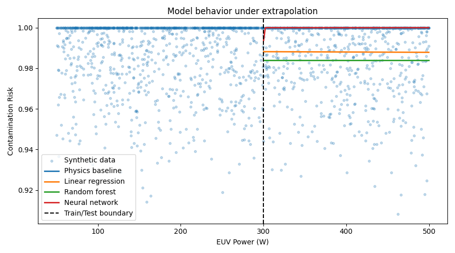

# Learning Gas Flow Scaling Laws for EUV Source Contamination Analysis using ML

This project investigates whether simple machine-learning models can learn
nonlinear scaling laws in a simplified EUV contamination control system using
synthetic, physics-inspired data.

Goal:  see how different model classes behave under interpolation and extrapolation when learning nonlinear and saturating relationships.

EUVs are the most advanced form of Lithography, used to make the performant and efficient processors we use today. EUV stands for Extreme Ultraviolet. It allows for very low nanometer level lithography.
---

## Problem Setup

A basic model of EUV source contamination is constructed using scaling
assumptions:

- Debris generation scales nonlinearly with EUV power
- Hydrogen gas flow mitigates contamination with diminishing returns
- Contamination risk saturates at high power

Synthetic data is generated from this model with added noise.  
Machine-learning models are trained only on low-power data and evaluated on
higher power regimes to study extrapolation behavior.

---

## Models Evaluated

- Physics-inspired baseline (hand-designed scaling law)
- Linear regression
- Random forest regressor
- Neural network (bounded output)

Each model represents a different inductive bias.

---

## Key Results

- Linear regression fails to represent nonlinear scaling
- Random forests interpolate well but fail to extrapolate
- Neural networks extrapolate smoothly but require constraints
- Simple physics priors provide strong global structure

The figure below summarizes model behavior under extrapolation:



---

## How to run after cloning repo

```bash
# Clone repository
git clone <your-repo-url>
cd ml-euv

# Create virtual environment
python3 -m venv venv
source venv/bin/activate

# Install dependencies
python -m pip install -r requirements.txt

# Generate data
python src/generate_data.py

# Train models
python src/train.py

# Evaluate and plot
python src/eval.py